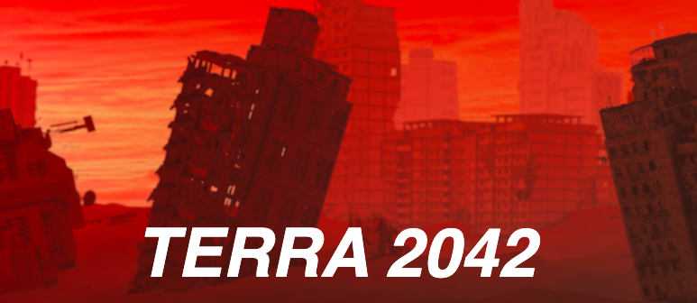

# [Terra 2042](terra-2042.herokuapp.com)

## Overview

Terra 2042 is a web-based tabletop card game. It features live multiplayer games, custom deck building, and a shop to spend your spoils. Terra 2042 takes place in a post-apocalyptic world where players must battle each other to protect their settlements. 

## Tech Stack

- [MongoDB](https://www.mongodb.com/)
- [Express](https://expressjs.com/)
- [React](https://reactjs.org/)
- [Node](https://nodejs.org/en/)
- [Redux](https://redux.js.org/)
- [Socket.io](https://socket.io/)
- [React DnD](https://react-dnd.github.io/react-dnd/about)
- [Material UI](https://material-ui.com/)

## Features

### Shop for cards
 
Users start out with five gold coins they can use in the shop to buy new cards. Players also earn gold coins by playing games; three for the winner, one for the loser.
### Build your own deck
 
Aside from the default deck, users can build their own custom decks consisting of cards in their collection.
### Check your stats
 
Users can visit the stats page to see their match history. In the stats page, users can see all their recent games, including score, opponent's name, and outcome. 
### Play with your friends
 
Terra 2042 is a two-plater game. Create a game and share the room code with a friend to battle it out.
### Trash talk your opponent
 
Trash talk your opponent while in game and assert your dominance.

## Challenges

- Terra 2042 makes use of a NoSQL database, something we were not familiar with. One of our challenges was figuring out how to 
set up associations in a document model as opposed to a relational model, especially when respresenting and storing game state.
- Saving and loading in real-time was also a challenge we faced intrinsic to multiplayer games. We had to devise a way of validating our API so that only valid moves by the correct player could be made. We also had to come up with a way to provide real-time updates to both players. Therefore, after each valid move, a socket is sent to the opposing player notifying them that the game has been updated. 
- Another challenge we faced was connecting 2 people to play a game with each other without interference from other games. This meant that socket connections had to be kept private so players wouldn’t be notified about messages or moves coming from a different game. This was done by defining socket channels that players could join by providing a shared code.

## How to play

### Create/join a game
1. Click "PLAY" on the main menu to visit the games lobby.
2. Select your deck and class.
3. If you are the first player in the lobby, click on "CREATE GAME" to generate a room code. Send the code to your friend!
4. If you are the second player in the lobby, click on "JOIN GAME" and enter the room code you got from your friend.
The match will start as soon as two players have entered the game.

### Playing a game
1. A player will be randomly chosen to go first.
2. At the start of your turn, the turn-clock will begin to tick. Hurry, you only have 30 seconds!
3. The player with the first turn will start out with 3 cards. The other player starts out with 4.
4. At any given turn, a player has the option to:
- Draw a card
- Summon a card onto the playing field
- Attack an opponent's card
- Attack an opponent's hero
5. Each player starts out with 30 settlers, which is the equivalent to health points.
6. At the end of their turns, players will receive an additional settler.

### Drawing a card
- You can draw a card at any point during your turn.
- A card can only be drawn once per turn.
- Attempting to draw from an empty deck will decrease that player's settlers by 2.

### Summoning a card
- To summon a card, simply drag it from your hand onto your playing field (just below the dotted line.)
- Summoning cards costs settlers. The cost to play each card is displayed on the top of the card. 
- You can summon as many cards as you want in a turn. However, your battlefield can only hold 5 cards at a time.
- A summoned card cannot be used to attack until your next turn.

### Attacking with a card
- To attack with a card, simply drag it onto an opponent's card or hero.
- You will know a card is ready to attack when it starts to pulse on the battlefield.
- A card may only attack once per turn.
- After an attack, both cards will receive damage based on the other's attack.
- A card whose health reaches 0 will be removed from the board.
- A card attacking a hero takes no damage. 

### Winning the game
- The game is over when one of the player's settlers reaches 0.
- The winning player is compensated with 3 gold coins.
- The losing player is compensated with 1 gold coin.

### Classes & Special Abilities
Before each game, players select a class that gives them a unique ability to use once during their turn.
#### Forager (passive)
The Forager class gives players 2 settlers instead of 1 at the end of each turn.
#### Medic (active)
The Medic class allows players to heal a card on their battlefield for 3 extra health points. 
#### Metalhead (active)
The Metalhead class allows a player to summon a minion straight onto the battlefield if there's not already a minion in play.
#### Cultist (active)
The Cultist class allows a player to draw an extra card at the cost of 2 extra settlers.
#### Bandit (active)
At the cost of 2 settlers, the Bandit class gives players the option to either: Active a previously unactivated fighter on their battlefield, or decrease their opponent's settlers by 4. 
#### Hoarder (passive)
The Hoarder class gives players a 1 in 4 chance to draw 2 cards instead of 1. 
